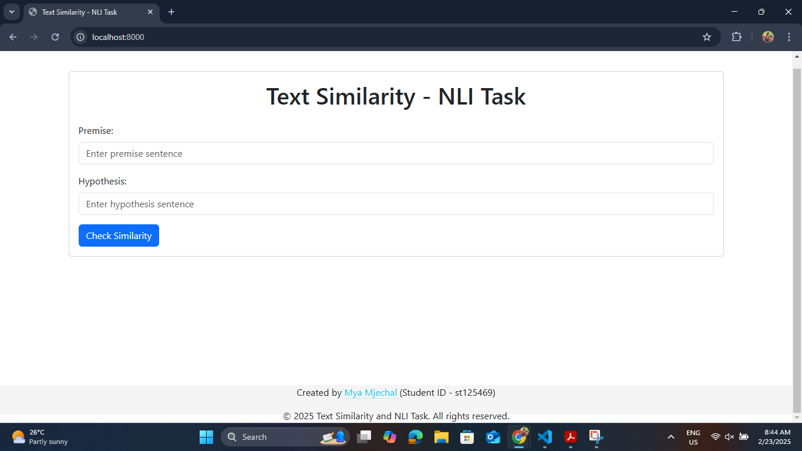
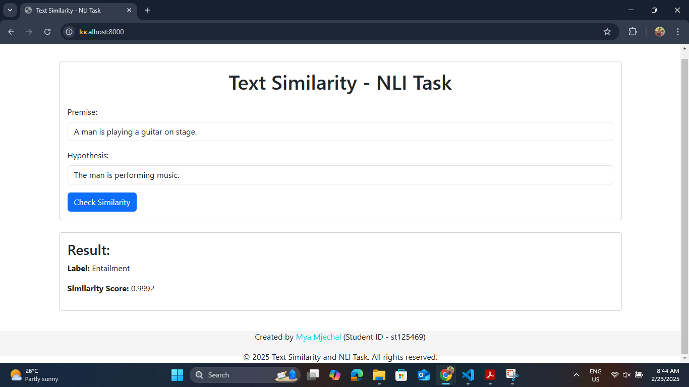

# A4: Do you AGREE?

**AT82.05 Artificial Intelligence: Natural Language Understanding (NLU)**  
**Instructors:** Professor Chaklam Silpasuwanchai, Todsavad Tangtortan

## Table of Contents
- [Student Information](#student-information)
- [Project Overview](#project-overview)
- [Tasks](#tasks)
  - [Task 1: Training BERT from Scratch](#task-1-training-bert-from-scratch)
  - [Task 2: Sentence Embedding with Sentence BERT](#task-2-sentence-embedding-with-sentence-bert)
  - [Task 3: Evaluation and Analysis](#task-3-evaluation-and-analysis)
  - [Task 4: Text Similarity Web Application](#task-4-text-similarity-web-application)
- [Installation Setup](#installation-setup)
- [Usage](#usage)
- [Demo and Screenshots](#demo-and-screenshots)
- [References](#references)

## Student Information
- **Name:** Mya Mjechal
- **Student ID:** st125469
- **Major:** AIT - Data Science and Artificial Intelligence (DSAI)
- **Course:** AT82.05 Artificial Intelligence: Natural Language Understanding (NLU)
- **Assignment:** NLP A4: Do you AGREE?

## Project Overview

The "Do you AGREE?" project focuses on leveraging deep learning techniques to understand semantic relationships between texts. The project is divided into four key tasks:

1. **Training BERT from Scratch:** Build and train a BERT model using a Masked Language Modeling (MLM) objective.
2. **Sentence Embedding with Sentence BERT:** Utilize a Siamese network structure with the trained BERT to generate semantically rich sentence embeddings.
3. **Evaluation and Analysis:** Evaluate the model’s performance on Natural Language Inference (NLI) tasks using datasets like SNLI or MNLI.
4. **Text Similarity Web Application:** Develop a simple web app that demonstrates the model’s capability to predict semantic similarity (entailment, neutral, or contradiction) between sentence pairs.

## Tasks

### Task 1: Training BERT from Scratch
- **Objective:** Implement a Bidirectional Encoder Representations from Transformers (BERT) model from scratch using a masked language model (MLM) objective.
- **Approach:**
  - Modify and run the provided `BERT-update.ipynb` notebook.
  - Train the model on a subset (100k samples) of large corpora BookCorpus.
  - Save the trained model weights for subsequent tasks.
- **Datasets:**
  - [BookCorpus](https://huggingface.co/datasets/bookcorpus/bookcorpus)
- **Hyperparameters:**
  - **Seed:** 1234
  - **Vocabulary Size:** 23069
  - **Number of Layers:** 6
  - **Number of Attention Heads:** 8
  - **Model Dimension (d_model):** 768
  - **Feed-Forward Dimension (d_ff):** 3072
  - **Key Dimension (d_k):** 64
  - **Value Dimension (d_v):** 64
  - **Number of Segments:** 2
  - **Maximum Masked Tokens:** 3
  - **Maximum Sequence Length (max_len):** 10000
  - **Batch Size:** 6
  - **Epochs:** 500

### Task 2: Sentence Embedding with Sentence BERT
- **Objective:** Fine-tune the pre-trained BERT model to generate semantically meaningful sentence embeddings.
- **Approach:**
  - Build a Siamese network structure using the trained BERT model.
  - Fine-tune on an NLI dataset (MNLI) to learn to distinguish between entailment, neutral, and contradiction relationships.
  - Implement the Softmax loss function applied to a combined feature vector of two sentences and their absolute difference.
- **Datasets:**
  - [MNLI](https://huggingface.co/datasets/glue/viewer/mnli)
- **Hyperparameters:**
  - **Seed:** 55
  - **Number of Layers:** 6
  - **Number of Attention Heads:** 8
  - **Model Dimension (d_model):** 768
  - **Feed-Forward Dimension (d_ff):** 3072
  - **Key Dimension (d_k):** 64
  - **Value Dimension (d_v):** 64
  - **Number of Segments:** 2
  - **Maximum Masked Tokens:** 3
  - **Maximum Sequence Length (max_len):** 10000
  - **Batch Size:** 16
  - **Epochs:** 5
- **Reference:** [Sentence-BERT: Sentence Embeddings using Siamese BERT-Networks](https://aclanthology.org/D19-1410/)

### Task 3: Evaluation and Analysis
- **Objective:** Assess the performance of the fine-tuned model on NLI tasks.
- **Metrics:**
  - Accuracy, precision, recall, and F1 score on MNLI dataset.

| **Model**   | **Dataset** | **Average Cosine Similarity** | **Accuracy** | **Precision** | **Recall** | **F1 Score** |
|-------------|-------------|--------------|--------------|---------------|------------|--------------|
| S-BERT ON BERT  | MNLI   |     0.9968    |     0.3300    |     0.22     |    0.32    |     0.2526     |

### Limitations and Challenges

- **Performance Comparison:**
    - The model's performance was compared against benchmark metrics, revealing that while the average cosine similarity was high (0.9968), the accuracy (0.33), precision (0.22), recall (0.32), and F1 score (0.2526) were significantly lower than expected.

- **Implementation Challenges:**
    - **GPU Limitation:** Training BERT from scratch and fine-tuning Sentence BERT required substantial computational resources. The limited availability of GPUs extended the training time and restricted the batch size, impacting the overall performance. Had to train S-BERT with Higher CPU (51 GB RAM) due to GPU limitation.
    - **Dataset Size:** The subset of the BookCorpus dataset (100k samples) used for training BERT from scratch and the subset of the MNLI dataset (1000 samples) used for training S-BERT on BERT model may not have been sufficient to capture the full complexity of the language, leading to suboptimal model performance.
    - **Hyperparameter Tuning:** Finding the optimal hyperparameters for training and fine-tuning was challenging due to the computational constraints and the extensive search space.

- **Potential Improvements:**
    - **Increased Computational Resources:** Utilizing more powerful GPUs or TPUs could significantly reduce training time and allow for larger batch sizes, potentially improving model performance.
    - **Larger Training Dataset:** Training on a larger dataset or using additional corpora could help the model learn more comprehensive language representations.
    - **Advanced Hyperparameter Optimization:** Implementing more sophisticated hyperparameter optimization techniques could help in finding better hyperparameter settings.
    - **Model Architecture Enhancements:** Exploring variations in the model architecture, such as increasing the number of layers or attention heads, could lead to performance improvements.

### Task 4: Text Similarity Web Application
- **Objective:** Develop a web application to demonstrate the text-embedding model’s capability for predicting text similarity and NLI outcomes.
- **Features:**
  - Two input boxes for entering sentence pairs or search queries.
  - Display of model predictions for NLI (entailment, neutral, or contradiction) and cosine similarity.
- **Technologies:**
  - **Backend:** Flask, PyTorch
  - **Frontend:** HTML, Bootstrap

## Installation Setup

1. **Clone the Repository:**
    ```bash
    git clone https://github.com/MyaMjechal/nlp-a4-do-you-agree-web-with-bert.git
    cd nlp-a4-do-you-agree-web-with-bert
    ```

2. **Environment Setup:**
    - Ensure you have Python 3.8+ installed.
    - Navigate to the web application folder:
      ```bash
      cd app/code
      ```
    - Install the required dependencies:
      ```bash
      pip install -r requirements.txt
      ```

3. **Run the Web Application:**
    - Start the Flask server:
      ```bash
      python app.py
      ```
    - Open your browser and navigate to [http://localhost:8000](http://localhost:8000).

## Usage
Once the Python application is running, you can access the translation web application by opening your browser and navigating to http://localhost:8000. From there:

1. **Input sentence pairs** in English into the input boxes (Permise and Hypothesis).
2. **Click the "Check Similarity" button** to check text similarity and NLI task.
3. The web application will display the model’s prediction (entailment, neutral, or contradiction) and cosine similarity.

## Demo and Screenshots

###  Demo GIF  


_GIF 1: Demonstration of the Text Similarity and NLI Task web application in action_

### Screenshots  
**Web App Interface:**  


_Figure 1: Initial web interface of Text Similarity and NLI Task_

**Sample Prediction Result:**  


_Figure 2: Prediction result of Text Similarity and NLI Task with permise sentence 'A man is playing a guitar on stage.' and hypothesis sentence 'The man is performing music.'_

## References
- [BERT: Pre-training of Deep Bidirectional Transformers for Language Understanding](https://arxiv.org/abs/1810.04805)
- [Sentence-BERT: Sentence Embeddings using Siamese BERT-Networks](https://aclanthology.org/D19-1410/)
- [BookCorpus Dataset](https://huggingface.co/datasets/bookcorpus/bookcorpus)
- [MNLI Dataset](https://huggingface.co/datasets/glue/viewer/mnli)
